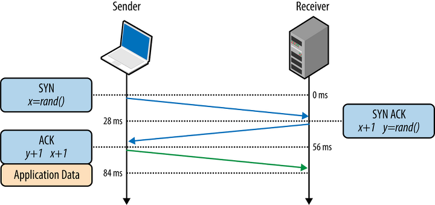

이 시리즈는 츠토무 토네가 쓴 성공과 실패를 결정하는 1%의 네트워크 원리를 읽고 공부한 내용을 정리한 것으로,
유저가 브라우저에 URL을 입력한 후에 원했던 화면이 보이기까지 어떤 단계를 거치는지를 살펴본다.

[유저가 브라우저에 URL을 입력한 후 벌어지는 일들 -1](https://choichoikule.github.io/blog/post-1)  
[유저가 브라우저에 URL을 입력한 후 벌어지는 일들 -2](https://choichoikule.github.io/blog/post-7)

# Step1. URL을 분석한다

유저는 크롬,사파리와 같은 브라우저를 열고 주소창에 http://https://choichoikule.github.io/와 같은 주소를 입력한다.
이러한 주소를 url이라고 하며 유저가 원하는 인터넷 사이트를 나타내는 주소이다. 유저는 주소를 입력함으로써 원하는 것을 불러온다.

### URL이란

좀더 자세하게 이 url이란 것을 살펴볼 필요가 있을 것 같다. 모든 이해는 자세한 정의에서 출발하니까.  
url의 사전적 정의를 찾아보면 다음과 같다. Uniform Resource Locator(URL)은 인터넷 자원의 위치를 나타내는 것으로, 웹에 게시된 어떤 자원을 찾기위해
브라우저에 의해 사용되는 메카니즘이다. 어렵게 적혀 있지만 쉡게 말하면 그냥 브라우저가 사용하는 주소체계이다. 이 url은 단순한 문자열 나열이 아니라,
protocol + domain + port + path + parameter + fragment 의 순서대로 각각 의미를 담은 요소로 이루어져 있다.

protocol은 사용자가 입력한 자원 위치에서 자원을 가져오기 위해 브라우저가 어떤 프로토콜을 사용해야하는지 명시하는 것이다.
흔히 보는 URL 주소에서 http:// 부분을 말한다. 대부분 http프로토콜을 사용해 웹 페이지를 가져오는 용도로 브라우저를 사용하기 때문에
이외에 다른 것이 있다는 게 낯설지만, 브라우저에 ftp:// mailto://등의 프로토콜을 입력하여 파일업로드나 메일 송신등을 지시할 수도 있다.

domain은 웹서버이름을 나타내며, path는 웹서버상의 자원위치를 의미한다. 물리적인 위치를 나타낼수도 있지만 대부분 웹서버에서 추상화하여 표현한다.
parameter는 웹서버에 제공하는 추가 파라미터로, 이 파라미터들은 & 기호로 구분된 키/값으로 짝을 이룬 리스트이다.
fragment는 일종의 자원 안에서 "bookmark" 로 해당 위치로 스크롤되며 해당 부분은 서버로 요청이 보내지지 않는다.

<!-- 위에서 잠깐 언급했듯이 인터넷상의 자원들은 숫자로 이루어진 실질적인 주소인 IP 주소라는 것을 가지고 있다. 이러한 숫자들을 외우는 것보다 문자로된 이름을 지어 명명하는 것이 편하기 때문에 domain을 사용하지만
이 domain이름만으로는
## IP주소체계

TCP/IP 네트워크는 서브넷이라는 작은단위의 네트워크를 라우터로 연결하여 전체 네트워크를 완성하는데 네트워크의 번호와
호스트 번호를 합쳐서 IP주소라고 한다.
IPv4체계에서 IP 주소는 32비트의 디지털 데이터로, 8비트씩 점으로 구분하여 10진수로 표기한다.
네트워크 주소 영역이 어디까지인지에 따라 IP주소를 클래스로 구분할 수 있고, 해당 클래스에 따라 기본 서브넷 마스크가 주어진다.
기본 서브넷 마스크는 네트워크 주소부분의 비트를 1로, 호스트부분의 비트를 0으로 표시하며, IP 주소와 서브넷 마스크를 AND 연산 하면 네트워크 주소를 구할 수 있다.
보안과 효율을 위해 호스트 번호 구간을 분할하여 서브네트워크를 만들어서 사용할 수도 있다. -->

위에서 domain이 웹서버 이름이라고 하였는데, 실제로는 이 domain이름만으로는 인터넷 자원을 찾아올 수가 없다. 왜냐하면, url을 입력해서 무언가를 인터넷으로부터 불러온다는 것은 내 컴퓨터에 있지 않은,
네트워크로 연결된 어떠한 다른 장치에 있는 자원을 가져오는 것인데, 네트워크 상에서 연결된 이 각각의 장치들은 도메인과 같은 문자열로된 이름이 아니라 특수한 번호를 가지고 식별되기 때문이다.
이러한 특수한 번호를 IP주소라고 하며 유저가 입력하는 도메인 이름은 이러한 IP주소와 매칭되어 할당되므로 웹브라우저에 도메인을 입력하면, 브라우저가 IP주소와 도메인 이름의 매칭정보를 가지고 있는 Domain Name System(DNS)서버를 조회하여 맞는 IP주소를 찾아서 인터넷 자원을 가져오게된다. (DNS 서버역시 하나의 서버이므로 이 시리즈 내용의 전체를 아우르는 네트워크 통신이 필요하다. 지금은 상세한 과정을 생략하기로하고 나중에 뒤에서 다시 설명하겠다.)

<!-- ### DNS서버를 조회하여 IP 주소 알아내기

DNS서버 역시 하나의 서버이므로 네트워크를 통해 데이터를 주고받는 과정이 필요하다.
데이터를 보내는 것은 어플리케이션의 단일 동작만으로는 불가능하며 컴퓨터 운영체제내부의 네트워크 제어 시스템이 함께 동작해야한다. 이 과정이 바로 그 유명한 OSI 7계층으로 표현된다.
DNS서버에 IP주소를 요청하기 위한 메세지 작성은 DNS 리졸버라고 하는 것이 담당하므로 브라우저는 리졸버를 호출하여 메세지 작성을 의뢰하고, 리졸버의 메세지가 전송되어 DNS서버로부터 응답이 오면 실제 IP주소를 알게된다고만 정리하고 다음 내용으로 넘어가겠다. -->

웹브라우저는 데이터를 전기신호로 변환하고 보낼 수 있는 능력은 없으므로 실제 IP주소를 알아낸 브라우저가 다음으로 하는 일은 TCP/IP와 같은 전송계층에게 메세지 전송을 의뢰하는 것이다.
TCP/IP와 같은 전송계층은 시스템 운영체제 안에 구현되어 있어 직접 이용할 수 없으므로 브라우저는 운영체제가 제공하는 소켓 인터페이스를 통해 시스템 콜 함수로 동작을 의뢰하게된다.
그 과정을 다음으로 살펴보자.

# step2 Request 송신을 의뢰한다

TCP와 IP는 전송계층으로 데이터를 전송할때 사용되는 프로토콜이다. IP는 인터넷상에서 한 호스트에서 다른 호스트로 데이터 묶음인 패킷을 보낼때 사용되는 프로토콜이며,
TCP는 IP 상위의 프로토콜로 네트워크 상의 두 종착지 프로세스 간의 통신을 제어하며 IP 프로토콜로 보내진 데이터들이 순서에 맞게 오류없이 조립되어 어플리케이션에 전달될 수 있도록 하는 프로토콜이다.
각각의 프로토콜을 거칠때마다 헤더가 붙게되며 그 헤더를 주고 받아서 각 계층에서 서로를 인식하고 정상적을 작동하게된다.

어플리케이션이 TCP에 데이터 전송을 의뢰하면, TCP는 소켓을 만들고, 서버소켓과 접속하여 데이터를 기록한 후 어플리케이션에 응답결과를 반환하고, 연결을 종료한다.
소켓이란 네트워크상에서 프로세스간 통신의 종착점을 의미하며 소켓의 실체는 통신에 필요한 제어정보를 기록한 컴퓨터의 메모리영역이라고 할 수 있다.
소켓 인터페이스는 디스크럽터라는 식별자를 어플리케이션에 넘겨주어 컴퓨터 내부에 다수로 존재하는 소켓중에 어떤 소켓을 확인해야하는지 알려준다.
그러나 이 디스크럽터는 내부에서 쓰이는 것이므로 외부에서는 알 수 없다. 그렇다면 어떻게 서버소켓에 접속하는 것일까? 우리는 앞서 url에 포트번호가 사용되는 것을 보았다. 포트번호는 호스트 내부의 프로세스가 할당받는 고유한 값이므로
포트번호를 입력하면 우리의 데이터를 제공할 서버프로세스를 특정짓게 되고 그 프로세스가 관리하는 소켓에 접속할 수 있게 되는 것이다. (소켓과 포트는 다르다.)  
커맨드창에서 netstat 명령을 실행했을때 현재 컴퓨터에 존재하는 소켓을 확인해볼 수 있다.

**socket()단계**  
어플리케이션 -> socket()호출 -> TCP 소켓만듬 : 메모리영역을 확보하고, 초기상태를 기록함
-> 소켓의 식별자인 디스크럽터를 어플리케이션에 알림  
**connect()단계**  
어플리케이션 -> connect()호출 -> TCP 서버소켓에 접속: tcp헤더를 주고받아서 서로가 확인되면 데이터 저장용 버퍼 메모리를 확보한다.
tcp헤더는 다음과 같은 정보를 담고 있고 각 부분의 내용에 따라 작동한다.

서버소켓에 접속하는 과정은 TCP 3way-handshake라고 불리는 과정이다.  
송신측에서 SYN의 초기값을 넣어서 보내면 수신측은 수신측의 SYN과 함께 ACK 에 SYN+1 값을 보낸다.
송신측은 수신측이 보냈던 ACK를 SYN에 넣고 ACK에 수신측이 보냈던 SYN+1한 값을 보낸다.
수신측은 ACK를 확인하고 접속이 이루어진다.

**write()단계**  
어플리케이션 -> write()호출 -> 송수신데이터버퍼메모리에 저장 후 어플리케이션에 알림  
**close()단계**  
TCP헤더 중 FIN 플래그를 보내서 종료한다.

tcp에서 이루어지는 작업은 위와 같고, 실제로는 데이터를 전송하기 위해 tcp헤더 작성을 완료하고 나면 IP프로토콜에 패킷 전송을 의뢰한다.
IP프로토콜은 IP헤더와 MAC헤더를 덧붙여 패킷을 완성한다. MAC헤더는 이더넷용 헤더이고 IP헤더는 IP용 헤더이다. 수신처 MAC 주소는 IP부분에서 ARP 프로토콜을 사용하여
이더넷에 연결된 전원에게 패킷을 보내는 브로드캐스트를 보내서 이 브로드캐스트에 화답하는 주소를 찾아서 사용한다.

# step3 데이터를 변환한다.

IP프로토콜이 데이터를 완성하고 나면 직접 물리적인 송신을 위해 LAN 드라이버를 통해서 LAN 어댑터를 작동시킨다. LAN어댑터는 MAC주소가 기입된 ROM과 패킷을 일시저장할 버퍼메모리, 이더넷 송수신을 제어하는 부분인 MAC, 신호를 송수신하는 PHY회로, LAN 케이블에 접속하는 RJ-45커넥터로 이루어진다.
LAN 어댑터는 받은 데이터를 0101의 전기 신호로 변환하는데  
앞에 프리앰블 스타트 프레임밀리미터와 프레임 체크 시퀀스를 양끝에 붙여서

참고:  
[성공과 실패를 결정짓는 1%의 네트워크 원리](https://www.aladin.co.kr/shop/wproduct.aspx?ItemId=163484025)  
[ITstory](https://copycode.tistory.com/32)  
[TCPvsIP](http://www.differencebetween.net/technology/internet/difference-between-tcp-and-ip/)  
[포트와소켓 차이점](https://blog.naver.com/PostView.nhn?blogId=myca11&logNo=221389847130&categoryNo=24&parentCategoryNo=0&viewDate=&currentPage=1&postListTopCurrentPage=1&from=postView)  
[TCP헤더](https://evan-moon.github.io/2019/11/10/header-of-tcp/)
