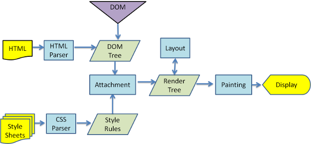
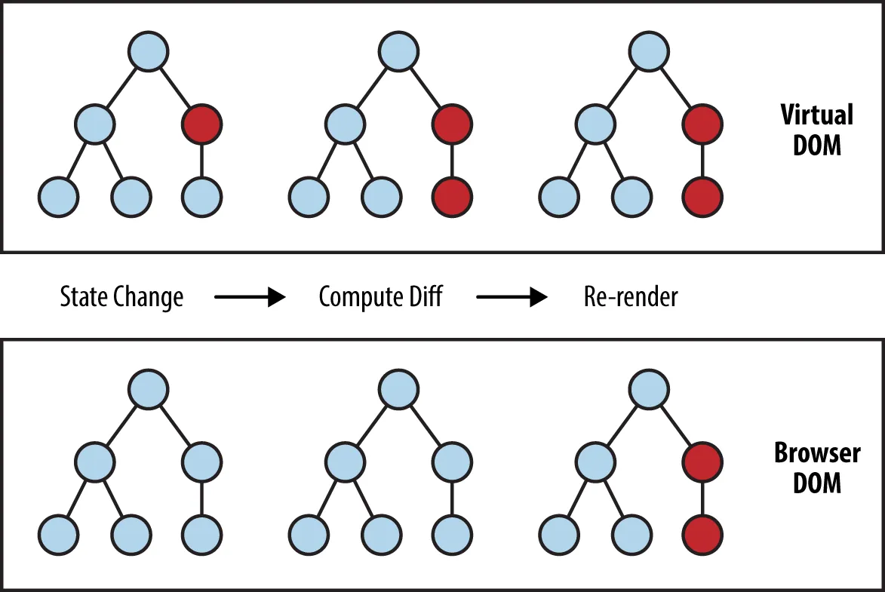
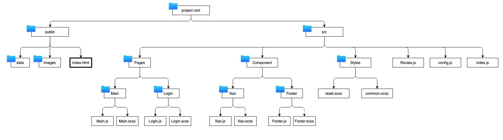

이 시리즈는 사내에서 리액트에 대해 간단한 세미나를 준비한 내용을 정리한 것입니다.

[Intro](https://choichoikule.github.io/blog/post-3)  
[Class](https://choichoikule.github.io/blog/post-4)  
[Hooks](https://choichoikule.github.io/blog/post-5)

### 리액트의 탄생배경 응애응애

요즘의 웹은 단순히 웹 페이지 가 아니라, 웹 애플리케이션입니다. 브라우저 상으로도 정말 자연스러운 흐름으로 매우 많은것들을 할 수가 있죠. 자, 그런데 어떠한 유저인터페이스를 동적으로 나타내기위해서는 정말 수많은 상태를 관리해줘야합니다.이를 위해 DOM을 조작하려고 하면 `document.getElementById` 와같은 것들을 써가면서 DOM에 대한 레퍼런스를 찾고 거기에 접근해서 원하는 작업을 해야하는데 프로잭트가 커질 수록 이것은 매우 귀찮은 일이 될것입니다.

웹 개발을 하게 될 때, 이러한 귀찮은 DOM 관리와 상태값 업데이트 관리를 최소화하고, 오직 기능 개발, 그리고 사용자 인터페이스를 구현하는 것에 집중 할 수 있도록 하기위해서 정말 여러 라이브러리들 혹은 프레임워크들이 만들어졌습니다.리액트는 그 중 하나로 페이스북에사 만든 현재 가장 인기있는 자바스크립트 프론트엔드 라이브러리입니다.

페이스북이 리액트를 만들기 전에도, 이미 Angular, Backbone, Knockout.js, Ember 등의 수많은 프레임워크들이 존재했습니다. 그리고 해당 프레임워크들은 데이터단을 담당하는 모델(Model), 사용자의 화면에서 보여지게 되는 뷰(View), 그리고 사용자가 발생시키는 이벤트를 처리해주는 컨트롤러 (Controller) 로 이뤄진 MVC 패턴, 그리고 MVC 에서부터 파생된 MVVM(View Model), MVW(Whatever) 등의 패턴들로 이뤄져있죠.

여기서 공통점은 바로 모델입니다. 방금 언급했던 프레임워크들의 모델은, 대부분 어떻게 작동하냐면, 양방향 바인딩을 통하여 **모델에 있는 값이 변하면, 뷰에서도 이를 변화시켜주고 뷰가 변해도 모델이 변합니다.** 여기서 핵심적인 부분은 **변화시켜준다는** 부분입니다. 일단 첫 화면을 보여주고, 변화에 따라 필요한곳을 바꿔주는거죠.

변화(Mutation)라는것은 상당히 복잡한 작업입니다. 특정 이벤트가 발생했을때, 모델에 변화를 일으키고, 변화를 일으킴에 따라 어떤 DOM 을 가져와서 어떠한 방식으로 뷰를 업데이트 해줄 지 로직을 정해줘야 하는데요, 페이스북에서는 리액트를 만들기전에 이러한 발상을 했습니다:

**" 그냥 Mutation 을 하지 말자. 그 대신에, 데이터가 바뀌면 그냥 뷰를 날려버리고 새로 만들어버리면 어떨까? "**

그러니까 단방향 데이터 바인딩을 사용해서 모델이 바뀌면 뷰가 변경되는 방법만을 허용하고, 그때그때마다 뷰를 새로그리겠다는 의미입니다. 그래서 리액트는 오로지 뷰에만 신경쓰고 다른 프레임워크들 처럼 개발에 필요한 모듈들 HTTP통신, 라우터 같은 것들을 제공하지 않습니다. 필요하면 사용자가 써드파티 라이브러리를 알아서 설치해야합니다.
그런데 리액트가 뷰를 그때그때 새로 그린다고 했는데 브라우저가 무슨 게임 엔진도 아니고, DOM 기반으로 작동하는 웹페이지는 그때 그때 새로 뷰를 만들어버리라고 하면 성능적으로 엄청난 문제가 있을 것입니다.

그래서 사용하는게 바로, Virtual DOM 입니다.

Virtual DOM 은 가상의 DOM 입니다. 변화가 일어나면, 실제로 브라우저의 DOM 에 새로운걸 넣는것이 아니라, 자바스크립트로 이뤄진 가상 DOM 에 한번 렌더링을 하고, 기존의 DOM 과 비교를 한 다음에 정말 변화가 필요한 곳에만 업데이트를 해주는 것이죠.

이 Virtual DOM 을 사용함으로서, 데이터가 바뀌었을 때 더 이상 어떻게 업데이트 할 지를 고려하는게 아니라, 그냥 일단 바뀐 데이터로 일단 그려놓고 비교를 한다음에, 바뀐 부분만 찾아서 바꿔주는겁니다.

**리액트는 이 가상돔개념을 활용해서 화면을 그리는 오직 뷰만 신경쓰는 라이브러리입니다.**

### 그래서 정확하게 virtual DOM이란 놈이 어떻게 작동하는건데?



일단 브라우저가 어떻게 작동하는지 알아봅시다.

1) **Parser -** 각 파일들을 브라우저가 알아들을 수 있게 변환.

2) **DOM Tree** - 파일의 경우, 각 태그의 관계도 형성을 위해 DOM 트리 생성.

3) **Attachment** - HTML의 각 태그에 맞는 스타일(CSS) 정보를 객체 형태로 다음 단계로 넘겨줌.

4) **Render Tree** - 외부 CSS 파일이 선언되어있다면 이를 필요료 하는 각 HTML 엘리먼트에 결합 후, 이전 Attachment에서 전달받은 스타일 값 들을 계산, 그리고 레이아웃 정보 형성.

5) **Layout** - 렌더 트리 작업이 끝난 레이아웃에 대해서 좌표 부여.

6) **Painting** - 렌더링이 끝난 각 레이아웃들에게 실제 사용자에게 보여질 모양과 색 부여.

DOM 조작의 실제 문제는 각 조작이 레이아웃 변화, 트리 변화와 렌더링을 일으킨다는겁니다. 그래서, 예를 들어 여러분이 30개의 노드를 하나 하나 수정하면, 그 뜻은 위에있는 저 과정들을 30번 반복 해야한다는 뜻입니다. 30번의 (잠재적인) 레이아웃 재계산과 30번의 (잠재적인) 리렌더링을 초래한다는 것이죠.

가상돔은 돔에서 **일어나게 될 변화를** 브라우저의 처리과정 중 렌더링 과정까지(Painting, Display 단계는 거치지 않음) 진행하면서 그 기록을 저장해두고, 실제 DOM에게 그 변화의 결과만을 전달해주어, 사용자에게 보여주게 됩니다. 레이아웃 계산이 한번만 이루어지는 것입니다. 그 결과 레이아웃계산과 리렌더링의 규모는 커지겠지만 연산하는 횟수를 줄일 수 있게되는겁니다. 최적화를 잘 하지않으면 사실 가상돔방식이 크게 퍼포먼스 향상을 가져오지는 않습니다. 가상돔은 필수는 아닙니다. 실제로, Angular는 실제 DOM 위에서 동작함에도 변경감지 구현 기능이 따로 존재하여 성능을 높이고 있다는 것을 참고하시기 바랍니다.



### 리액트의 기본 단위

리액트 프로젝트에서 웹의 어떤 특정 부분이 어떻게 생길지 정하는 선언체를 컴포넌트라고 합니다. 컴포넌트는 재사용이 가능한 API로 수많은 기능들을 내장할 수 있고, 컴포넌트 하나에서 해당 컴포넌트의 생김새와 작동방식을 선언합니다. 리액트의에서 화면을 그릴 수 있는 최소단위를 리액트 엘리먼트라고 하며, 이러한 리액트 엘리먼트 묶음들이 리액트 컴포넌트 내부에 정의되어있고 그에따라 브라우저가 화면을 보여주는 것입니다. (컴포넌트를 다루는 방법은 뒤의 본격적인 내용에서 다룹니다.)

```jsx
const element = <h1>Hello, world</h1>; <= 이게바로 리액트 엘리먼트얌
```

리액트 엘리먼트들을 작성할때에는 리액트 특유의 문법인 JSX를 사용할 수 있습니다. JSX는 자바스크립트의 확장문법이며 다른 프레임워크들이 HTML 마크업 기반으로 그 위에 템플릿 문법을 추가해 컴포넌트의 구조와 구성요소를 정의하는 반면, React는 XML 포맷의 템플릿을 직접 자바스크립트에 내장시키는 형태로 JSX를 만들어냈습니다. JSX를 사용할때는 다음과 같은 규칙을 지켜야 합니다.

1.  반드시 하나의 Dom으로 묶여야하고(virtual DOM에서 컴포넌트 변화를 감지할때 컴포넌트 내부는 하나의 DOM트리구조로 이루어져 있어야 효율적으로 비교할 수 있기 때문입니다.),
2.  태그는 반드시 닫아주어야하며, 셀프클로징 가능
3.  클래스를 사용할때는 클래스네임을, 스타일등 태그에 속성을 추가할때는 카멜케이스로 작성해야한다.
4.  자바스크립트를 사용하고 싶을때는 {} 중괄호로 감싼다음 작성한다. 아래와 같이 map같은 걸 사용해도 되고 조건부식도 사용할 수 있습니다.

```jsx
올바른 예시)
const arr = ['1번','2번']
const name = '레드'
return (
<>
<p>안녕 내이름은 {name}이야</p>
<div>first</div>
<div style={{ backgroundColor: 'blue'}}>second</div>
{
	arr.map((i,index)=>{return (<button key={index}>{i}</button>)})
}
<div className={"3번째얌"}>third</div>
<Child />
</>
)
```

지금까지 리액트에 대한 간단한 소개였습니다. 리액트를 사용해 실제로 개발하려고 하면 막막합니다. 위에서 말했듯이 개발에 필요한 모듈을 기본으로 제공하지 않고, 서드파티(Third party) 라이브러리에 의존하기 때문입니다. 그래서 초심자의 빠른 개발환경 구축을 위해서 Create React App이라는 툴을 제공하여 진입 장벽을 낮추고 있습니다. CRA를 설치해서 손쉽게 리액트 프로젝트를 시작해볼 수 있습니다. CRA로 프로젝트 틀을 잡는다고 해도 여전히 어떻게 프로젝트를 구성해야하는지 어려울 수 있습니다. 그래서 리액트 프로젝트의 구조를 소개하고 실질적인 컴포넌트 작성법에 대해서 소개하겠습니다.

## 리액트의 프로젝트 구조

다음은 일반적인 리액트 프로젝트 구조입니다. 사용할 써드파티 라이브러리에 따라서 조금식 달라질 수 있습니다. 아래는 라우터를 위해 cra + 리액트 라우터를 사용했을 경우의 프로젝트 구조입니다.



public폴더에 있는 index.html 파일을 보면 아래와 같이 id root의 div가 들어가있습니다.

public/index.html

```jsx
<!DOCTYPE html>
<html lang="en">
  <head>
    <meta charset="utf-8" />
    <link rel="icon" href="%PUBLIC_URL%/favicon.ico" />
    <meta name="viewport" content="width=device-width, initial-scale=1" />
    <meta name="theme-color" content="#000000" />
    <meta
      name="description"
      content="Web site created using create-react-app"
    />
    <title>React App</title>
  </head>
  <body>
    <div id="root"></div> //!!!!!!root당!!!!!
  </body>
</html>
```

src폴더에 있는 index.js 폴더를 보면, ReactDOM.render라는 함수가 보입니다.
리엑트 엘리먼트들을 직접 DOM노드를 지정해 렌더링해줄때 사용하는 함수입니다. 해석하면 root 아이디를 가진 DOM 노드에 <Routes /> 컴포넌트를 렌더링 하라는 뜻입니다.

src/index.js

```jsx
import React from "react"
import ReactDOM from "react-dom"
import Routes from "./Routes"
import "./Styles/common.scss"
import "./Styles/reset.scss"

ReactDOM.render(<Routes />, document.getElementById("root"))
```

src폴더에 있는 Routes파일까지 같이 볼까요 react-router dom을 활용해서 라우팅을 하려면 이런식으로 작성하면됩니다.

src/Routes.js

```jsx
import React from "react"
import { BrowserRouter as Router, Switch, Route } from "react-router-dom"

import ItemDetail from "./Pages/ItemDetail/ItemDetail"
import ItemList from "./Pages/ItemList/ItemList"
import Main from "./Pages/Main/Main"
import SignIn from "./Pages/SignIn/SignIn"
import SignUp from "./Pages/SignUp/SignUp"

class Routes extends React.Component {
  render() {
    return (
      <Router>
        <Switch>
          <Route exact path="/ItemDetail" component={ItemDetail} />
          <Route exact path="/ItemDetail/:productId" component={ItemDetail} />
          <Route exact path="/ItemList" component={ItemList} />
          <Route exact path="/" component={Main} />
          <Route exact path="/SignIn" component={SignIn} />
          <Route exact path="/SignUp" component={SignUp} />
        </Switch>
      </Router>
    )
  }
}
export default Routes
$
```

참고:  
[https://velopert.com/3612](https://velopert.com/3612)  
[https://velopert.com/3236](https://velopert.com/3236)  
[https://www.samsungsds.com/kr/insights/frameworks.html](https://www.samsungsds.com/kr/insights/frameworks.html)  
/ 리액트를 다루는 기술 책과 나으 뇌
