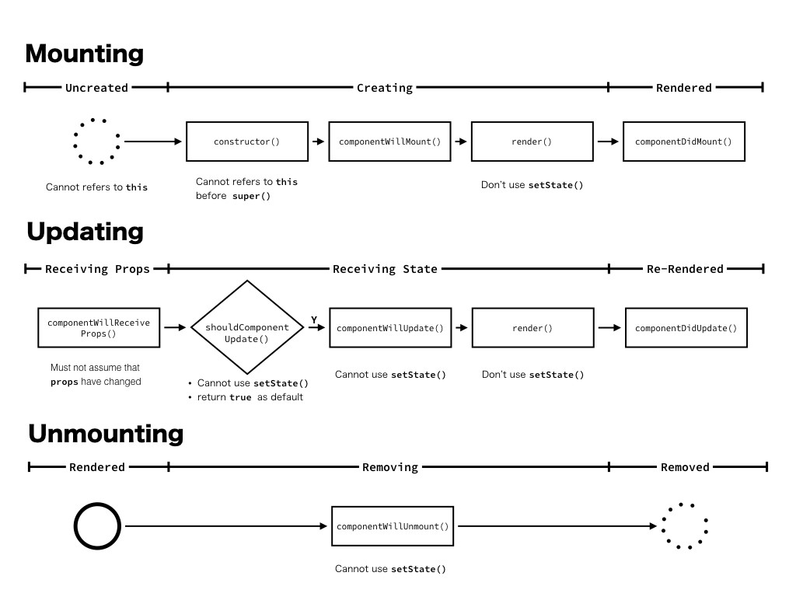
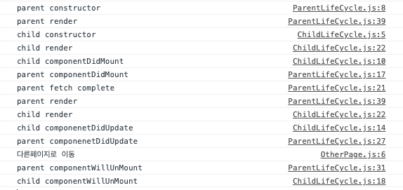

이 시리즈는 사내에서 리액트에 대해 간단한 세미나를 준비한 내용을 정리한 것입니다.

[Intro](https://choichoikule.github.io/blog/post-3)  
[Class](https://choichoikule.github.io/blog/post-4)  
[Hooks](https://choichoikule.github.io/blog/post-5)

리액트를 사용할 때 컴포넌트를 클래스 또는 함수로 정의할 수 있습니다. 클래스형 컴포넌트보다 함수형 컴포넌트들을 사용하라고 공식문서에서도 권고하고 있지만, 리액트가 컴포넌트들을 그리는 방식을 이해하기에 좋은 도구이기 때문에 클래스형 컴포넌트에 대해서 먼저 설명하겠습니다.

## React.Component와 class작성법

리액트 클래스 컴포넌트를 정의하고 사용하기 위해서는 아래와 같이 React.Component를 상속받아야합니다. 리액트는 오로지 view만을 담당하기 위한 라이브러리이며, 이러한 리액트에서 정의된 React.Component 역시 view를 표현하기위해 존재합니다.
때문에 view가 어떻게 보여질지에 대한 내부 상태 (state)를 가지고있으며, 컴포넌트 끼리는 상속이 아닌 합성을 통해 컴포넌트를 유용하게 사용할 수 있도록 다른 컴포넌트로부터 상태를 인자로(props) 받으며, 이들을 output 하기 위한 render( )라고 하는 메서드를 정의해주어야합니다.n

**(!! render는 필수 리액트 컴포넌트를 상속한 하위 클래스에서 반드시 사용해야하는 메서드입니다 !!)**

> React의 component란 상태 ( state ) 를 갖고 있고, 인자 값으로 Props 를 가지며, 반환 값으로 Element를 반환하는 "함수" 입니다!

```jsx
import React, { Component } from "react"

class Welcome extends Component {
  render() {
    return <h1> Hello World </h1>
  }
}

export default Welcome
```

위의 예시는 무상태 컴포넌트 입니다. 무상태 컴포넌트에서 우리는 HTML태그를 내보내서 화면에 뭔가를 표시할 수는 있지만 자바스크립트를 사용해 동적으로 움직일 수는 없습니다. 따라서 사용자와의 상호작용에 따라 변경되는 view를 만들고 싶다면 아래 예시와 같이 state를 사용해야합니다. state를 사용하는 클래스 컴포넌트는 다음과 같이 작성할 수 있습니다.

```jsx
예시1)

class Application extends React.Component {
  constructor(props) {
    super(props);
    this.state = {
      count: 0
			//여기서 state의 초기값을 할당합니다.
    }
this.handleClickIncrement = this.handleClickIncrement.bind(this);
//메서드를 바인딩해줍니다.
}

  handleClickIncrement() {
    this.setState({
		//state를 바꿀때엔 setState를 사용해야합니다.
      count: ++this.state.count
    });
  }

  render() {
    return (
      <div>
        <p>{this.state.count}</p>
				{/* state값을 표시해줍니다. */}
        <button onClick={this.handleClickIncrement}>+</button>
				{/* 버튼을 누르면 state값이 변합니다.*/}
      </div>
    );
  }
}

React.render(<Application />, document.getElementById('app'));

```

뭔가 조금 더 복잡해졌습니다!

위에서 작성된 컴포넌트는 +버튼을 누를때마다 초기값이 0이던 화면의 숫자가 점점 커지는 페이지입니다.
무상태 컴포넌트와 비교해서 추가된 것 중 우리가 살펴봐야하는 것은 **state**와 **this.setState, constructor()와 super()**입니다. 우선 state보다 먼저 constructor와 super가 뭔지 보도록 하겠습니다.
constructor와 super는 리액트 특유의 것이 아니라 순수 자바스크립트언어에 포함된 것입니다. `class (새로만들려는클래스명) extends (상속받아오려는클래스명)`이라는 선언구문자체도 순수 자바스크립트 문법입니다. 자바스크립트 언어에서의 클래스는 prototype을 기반으로 상속을 흉내내 사용하도록 고안된 특수한 함수의 일종입니다. 자바스크립트에서는 현재 존재하고 있는 객체를 프로토타입으로 사용하여, 해당 객체를 복제하여 재사용하는 것을 상속이라고 표현합니다.

constructor(생성자)는 클래스가 생겨날 때에 첫 번째로 실행되는 메소드 입니다. 생성자함수의 역할은 클래스의 설계도에 따라 새로운 클래스를 직접 만들어내는 것입니다. super 키워드는 부모의 생성자를 호출해서 여기에 덮어 쓰라는 뜻입니다. 자바스크립트의 문법에서, 클래스를 확장 받았을 때 자식 클래스의 생성자에서는 반드시 부모 생성자를 호출 시켜야 합니다. 위에서 설명했듯이 자바스크립트에서는 현재 존재하고 있는 객체를 프로토타입으로 사용하여, 해당 객체를 복제하여 재사용하는 것을 상속이라고 하기 때문입니다. 그렇지 않게 되면 오류가 발생합니다. 그 역할을 super 키워드가 하는것입니다.

또한 생성자 내부에서 `this.handleClickIncrement = this.handleClickIncrement.bind(this)` 를 볼 수 있습니다. 자바스크립트에서 객체의 메소드 형태로 호출되는 경우, this 는 객체 인스턴스를 참조합니다. 일반 함수로 호출되는 경우, this 는 현재 실행 호스트의 전역 객체를 참조하게 됩니다. 그러므로 constructor 에서 이벤트핸들러 메소드에 this(컴포넌트 인스턴스)를 바인딩 해주어 이벤트콜백 발생 시, 컴포넌트 참조가 가능하도록 해주어야 합니다.

2015년 리액트 버전 0.13부터는 기본 클래스필드 문법을 보조하기 때문에 아래와 같이 좀더 간단하게 클래스 컴포넌트를 작성할 수 있게 되었습니다. 클래스필드란 클래스 블록 안에서 할당 연상자(=)를 이용해 인스턴스 속성을 지정할 수 있는 문법입니다.

```jsx

예시2)

import React, { Component } from "react";

class Counter extends Component {
  state = {
    number: 2,
  };

  handleIncrease = () => {
    this.setState({
      number: this.state.number + 1,
    });
  };

  handleDecrease = () => {
    this.setState({
      number: this.state.number - 1,
    });
  };

  render() {
    return (
      <div>
        <h1>카운터</h1>
            <div>값: {this.state.number}</div>
        <button onClick={this.handleIncrease}>+</button>
        <button onClick={this.handleDecrease}>-</button>
      </div>
    );
  }
}

export default Counter;
```

참고로 클래스 몸체(class body)에는 클래스 필드 문법을 통한 인스턴스 속성을 지정 하는 것 이외에 메소드만 선언할 수 있으므로 아래와 같이 작성해서는 안됩니다. console.log()를 클래스컴포넌트 안에서 사용하고 싶다면 생명주기 함수나, render()와 같은 함수내부에서 사용해야 합니다.

```
// 클래스는 일반 함수가 아닙니다!
class Person {
  console.log('hello');
}

```

이제 다시 돌아와서 state와 setState 그리고 props까지도 뭔지 알아보도록 합시다.

## State와 Props

컴포넌트는 두 가지 인스턴스 속성(property) props와 state를 가지고 있습니다.
앞서 잠시말한것처럼 클래스는 일종의 설계도이고 그설계도를 통해 실제로 만들어진 것들을 인스턴스라고 합니다. 인스턴스 속성은 그 중에서도 모든 인스턴스들이 공유하는 클래스 속성이 아닌 인스턴스별로 독립되어있고, 각 인스턴스가 값을 따로 저장해야할때 사용되는 속성입니다. 그렇습니다. 리액트 컴포넌트를 상속해서 우리가 만든 컴포넌트가 따로 가질 수 있는 값입니다. 위에서 state={}로 인스턴스 속성을 따로 지정했었음을 기억하세요.

**state는 컴포넌트의 렌더링 결과물에 영향을 주는 데이터를 가지고 있는 일반 자바스크립트 객체입니다.** 브라우저에서 사용자와의 상호작용에따라 혹은 수신되는 데이터에 따라 동적으로 표현하고 싶다면 state로 지정해서 사용하면 됩니다. 위의 예시에서 카운트 버튼을 누름에 따라 변경될 숫자를 state에 지정했었던 것 처럼요.

**props도 state와 마찬가지로 렌더링에 영향을 주는 데이터를 가지고 있는 일반 자바스크립트 객체입니다. state와 다른 점은 컴포넌트의 mounting, updating 프로세스 시점에 값이 할당될 뿐 컴포넌트 내부에서 값을 변경할 수 없다는 점입니다.** 상황에 따라 변경되어야 하는 값들은 state를 이용해야합니다. 컴포넌트내부에서 props를 변경하고 싶다면 직접적으로 props를 변경하는 것이 아니라 부모 컴포넌트 내부에서 정의된 함수를 props로 받아서 사용해야 합니다.

props는 아래와 같이 사용합니다.

```jsx
부모컴포넌트)

import React, { Component } from 'react';
import MyName from './MyName';

class App extends Component {
  render() {
    return (
      <MyName name="리액트" />
    );
  }
}

export default App;
```

```jsx
자식컴포넌트)

import React, { Component } from 'react';

class MyName extends Component {
  render() {
    return (
      <div>
        안녕하세요! 제 이름은 <b>{this.props.name}</b> 입니다.
      </div>
    );
  }
}

export default MyName;
```

state랑 함수도 한번 props로 전달해볼까요.

```jsx
부모컴포넌트)

import React, { Component } from "react";
import PropsTestChild from "./PropsTestChild";

export class PropsTestParent extends Component {
  state = {
    color: "red",
  };

  handleColor = () => {
    this.setState({ color: this.state.color === "red" ? "black" : "red" });
  };

  render() {
    return (
      <div>
        <h1 style={{ color: this.state.color }}>Parent</h1>
        <PropsTestChild
          color={this.state.color}
          handleColor={this.handleColor}
        />
      </div>
    );
  }
}

export default PropsTestParent
```

```jsx
자식컴포넌트)

import React, { Component } from "react";

export class PropsTestChild extends Component {
  render() {
    return (
      <div>
        <h1 style={{ color: this.props.color }}>child</h1>
        <button onClick={this.props.handleColor}>색상변경</button>
      </div>
    );
  }
}

export default PropsTestChild;
```

> **다시 정리하면, state와 props는 렌더링 결과물에 영향을 주는 데이터를 가지고 있는 일반 자바스크립트 객체이며, state는 컴포넌트 내부의 값으로 변경이 자유롭고, props는 부모컴포넌트로 물려받은 것으로 컴포넌트 내부에서 직접 변경할 수 없습니다.**

# React 컴포넌트의 setState() API

우리는 위의 예제들에서 state를 변경할때 계속해서 setState라는 API를 사용해 왔습니다. 그렇습니다. setState는 이름 그대로 컴포넌트의 state를 변경할 때 사용하는 API입니다. 말장난같네요. 그냥 state를 직접 변경할 수도 있을 텐데 왜 굳이 API를 통해서 변경해야 할까요?state나 props의 변경을 감지하는 방식이 문자열이나 숫자가와 같은 타입이 아니라 객체나 배열 함수와 같은 참조형일 경우 실제값까지 비교하지 않고 해당 참조하는 메모리 주소가 같은지 비교하는 얕은 비교를 수행하기 때문입니다.
만약 state의 값을 직접 변경할 경우에는 해당 오브젝트의 reference 값이 변하지 않아 컴포넌트는 state가 변경되지 않았다고 볼 수밖에 없습니다. 그러므로 화면이 갱신되지 않는 것이지요. 따라서 React는 setState를 이용해 기존 state와 머지하여 state의 변경 가능성을 명시적으로 알려줍니다. 머지를 통해 새로 생성된 state의 reference 값은 기존과 다르므로 컴포넌트에서는 shallow compare를 통해 변경되었음을 알 수 있습니다.

> **React는 얕은비교로 이전 state와 바뀐 state를 비교합니다. 그러므로 직접 state를 변경하는 것이 아니라 setState를 이용해 기존 state와 머지하여 state의 변경 가능성을 명시적으로 알려주어야합니다.**

예를 들어 배열 state 를 바꾸려고 한다면 그 배열의 상태를 변경하지 않는 방법. 즉, 새로운 배열을 반환하는 방식을 사용해야합니다. 그래서 push는 안되고 concat은 됩니다.

### 일반 setState

일반적으로 사용하는 `setState(object)` 는 새로운 객체를 `this.state` 에 재할당하는 방식이다. 단, 동시 호출 호출을 보장하지 않으며 성능 향상을 위해 연속적인 setState 호출은 일괄 처리하게 됩니다.

```
state = { count: 0 }

this.setState({ count: this.state.count + 1 });
this.setState({ count: this.state.count + 1 });
this.setState({ count: this.state.count + 1 });

console.log(this.state.count); // 1 출력
```

컴포넌트가 다시 렌더링되는 시점에 count는 3이 될 것 같은 예상과 달리 1이 됩니다. 왜냐하면 `setState`가 `this.state.count` 에서 값을 읽어 오는데, 리액트는 컴포넌트가 다시 렌더링될 때까지 count를 갱신하지 않기 때문입니다. 그러므로 `setState`는 매번 count 값을 0으로 읽은 뒤에 이 값을 1로 설정하게됩니다.

### setState에 함수를 전달하는 방법

반대로, `setState(function)` 방식은 `this.state` 의 값을 내부 대기열(인자)에 담아 참조합니다. callback은 이전 상태 값을 참조해 다음 상태 값을 변경하는 함수이며, 이전의 상태를 다 처리하면 다음 처리의 참조(비교) 대상이 됩니다. 그래서 연속적인 `setState` 상황에서 동기적으로 작동하게 됩니다.

```
state = { count: 0 }

this.setState(prevState => { count: prevState.count + 1});
this.setState(prevState => { count: prevState.count + 1});
this.setState(prevState => { count: prevState.count + 1});

console.log(this.state.count); // 3 출력
```

아래는 **보장되지 않습니다**.

1. `setState` 호출 직후에 `state`가 즉시 갱신된다.
2. 한 컨텍스트 내에서의 `setState` 호출 수와 컴포넌트 업데이트 수는 같다.

자 이제 state를 어떻게 선언하고 바꾸는지 알게되었으니, 컴포넌트가 브라우저에 어떻게 나타나는지 과정과 함께 생명주기 함수를 함께 알아보려고 합니다.
UI를 구성하기 위해서는 화면에 컴포넌트를 그리고(Mounting), 갱신하고(Updating), 지워야(Unmounting) 합니다. 컴포넌트는 각 프로세스가 진행될 때에 따라 Lifecycle 함수로 불리는 특별한 함수가 실행됩니다. 개발자는 이를 재정의하여 컴포넌트를 제어하게 됩니다. 참고로 여기에 나온 생명주기 메서드는 이제는 UNSAFE\_로 분류된 레거시 생명주기 메서드도 포함하고 여전히 작동하지만 새로 작성할 코드에서는 UNSAFE는 사용하지 않을 것을 권장합니다. 때문에 기본적인 생명주기 메소드만 설명할 예정입니다.


🔼 React Lifecycle in ES6. Inspired by Simon Sturmer

### componentDidMount ()

`componentDidMount()`는 컴포넌트가 마운트된 직후, 즉 트리에 삽입된 직후에 호출됩니다. DOM 노드가 있어야 하는 초기화 작업은 이 메서드에서 이루어지면 됩니다. 외부에서 데이터를 불러와야 한다면, 네트워크 요청을 보내기 적절한 위치입니다.

이 메서드는 데이터 구독을 설정하기 좋은 위치입니다. 데이터 구독이 이루어졌다면, `componentWillUnmount()`에서 구독 해제 작업을 반드시 수행하기 바랍니다.

`componentDidMount()`에서 **즉시 `setState()`를 호출하는 경우도** 있습니다. 이로 인하여 추가적인 렌더링이 발생하지만, 브라우저가 화면을 갱신하기 전에 이루어질 것입니다. 이 경우 `render()`가 두 번 호출되지만, 사용자는 그 중간 과정을 볼 수 없을 것입니다. 이런 사용 방식은 성능 문제로 이어지기 쉬우므로 주의가 필요합니다. 대부분의 경우, 앞의 방식을 대신하여 `constructor()` 메서드에서 초기 state를 할당할 수 있습니다. 하지만 모달(Modal) 또는 툴팁과 같이 렌더링에 앞서 DOM 노드의 크기나 위치를 먼저 측정해야 하는 경우 이러한 방식이 필요할 수 있습니다.

### componentDidUpdate()

`componentDidUpdate()`는 갱신이 일어난 직후에 호출됩니다. 이 메서드는 최초 렌더링에서는 호출되지 않습니다. 컴포넌트가 갱신되었을 때 DOM을 조작하기 위하여 이 메서드를 활용하면 좋습니다. 또한, 이전과 현재의 props를 비교하여 네트워크 요청을 보내는 작업도 이 메서드에서 이루어지면 됩니다 (가령, props가 변하지 않았다면 네트워크 요청을 보낼 필요가 없습니다).

### componenetWillUnmount()

`componentWillUnmount()`는 컴포넌트가 마운트 해제되어 제거되기 직전에 호출됩니다. 이 메서드 내에서 타이머 제거, 네트워크 요청 취소, `componentDidMount()` 내에서 생성된 구독 해제 등 필요한 모든 정리 작업을 수행하세요. 이제 컴포넌트는 다시 렌더링되지 않으므로, `componentWillUnmount()` 내에서 **`setState()`를 호출하면 안 됩니다.** 컴포넌트 인스턴스가 마운트 해제되고 나면, 절대로 다시 마운트되지 않습니다.

코드를 한번 보겠습니다.

src/index.js

```jsx
import React from "react"
import ReactDOM from "react-dom"
import Routes from "./Routes"

ReactDOM.render(<Routes />, document.getElementById("root"))
```

src/Routes.js

```jsx
import React from "react"
import { BrowserRouter as Router, Switch, Route } from "react-router-dom"
import ParentLifeCycle from "./ParentLifeCycle"
import OtherPage from "./OtherPage"

class Routes extends React.Component {
  render() {
    return (
      <Router>
        <Switch>
          <Route exact path="/" component={ParentLifeCycle} />
          <Route exact path="/otherPage" component={OtherPage} />
        </Switch>
      </Router>
    )
  }
}
export default Routes
```

src/ParentLifeCycle.js

```jsx
import React, { Component } from "react"
import ChildLifeCycle from "./ChildLifeCycle"
import { withRouter } from "react-router-dom"

export class ParentLifeCycle extends Component {
  constructor() {
    console.log("parent constructor")
    super()
    this.state = {
      firstData: [],
      secondData: {},
    }
  }

  componentDidMount = () => {
    console.log("parent componentDidMount")
    fetch("http://localhost:3000/data/data.json")
      .then((res) => res.json())
      .then((res) => {
        console.log("parent fetch complete")
        this.setState({ firstData: res.data.firstData })
      })
  }

  componentDidUpdate = () => {
    console.log("parent componenetDidUpdate")
  }

  componentWillUnmount = () => {
    console.log("parent componentWillUnMount")
  }

  goPage = (e) => {
    this.props.history.push(`/otherPage`)
  }

  render() {
    console.log("parent render")
    return (
      <div>
        Parent
        <ChildLifeCycle childData={this.state.firstData} />
        <button onClick={this.goPage}>다른페이지로 이동</button>
      </div>
    )
  }
}

export default withRouter(ParentLifeCycle)
```

src/ChildLifeCylce.js

```jsx
import React, { Component } from "react"

export class ChildLifeCycle extends Component {
  constructor() {
    console.log("child constructor")
    super()
  }

  componentDidMount = () => {
    console.log("child componentDidMount")
  }

  componentDidUpdate = () => {
    console.log("child componenetDidUpdate")
  }
  render() {
    console.log("child render")
    return (
      <div>
        Child
        <div>data: {this.props.childData[0] && this.props.childData[0]}</div>
      </div>
    )
  }
}

export default ChildLifeCycle
```

src/OtherPage.js

```jsx
import React, { Component } from "react"
import { withRouter } from "react-router-dom"

export class OtherPage extends Component {
  render() {
    console.log("다른페이지로 이동")
    return <div>다른페이지</div>
  }
}

export default withRouter(OtherPage)
```

콘솔결과를 살펴보면 다음과 같습니다.



손자가 있으면 어떻게 될까요? 직접 만들어서 해보시길 바랍니다.ㅎㅎㅎ

참고:  
[https://medium.com/little-big-programming/react의-기본-컴포넌트를-알아보자-92c923011818](https://medium.com/little-big-programming/react%EC%9D%98-%EA%B8%B0%EB%B3%B8-%EC%BB%B4%ED%8F%AC%EB%84%8C%ED%8A%B8%EB%A5%BC-%EC%95%8C%EC%95%84%EB%B3%B4%EC%9E%90-92c923011818)  
[https://kosaf04pyh.tistory.com/42](https://kosaf04pyh.tistory.com/42)  
[https://velopert.com/3629](https://velopert.com/3629)  
[https://helloworldjavascript.net/pages/270-class.html](https://helloworldjavascript.net/pages/270-class.html)  
[https://helloworldjavascript.net/pages/270-class.html](https://helloworldjavascript.net/pages/270-class.html)  
[https://velog.io/@lshjh4848/클래스와-생성자](https://velog.io/@lshjh4848/%ED%81%B4%EB%9E%98%EC%8A%A4%EC%99%80-%EC%83%9D%EC%84%B1%EC%9E%90)  
[https://velog.io/@raram2/리액트의-참조형-데이터-업데이트#setstate의-한계](https://velog.io/@raram2/%EB%A6%AC%EC%95%A1%ED%8A%B8%EC%9D%98-%EC%B0%B8%EC%A1%B0%ED%98%95-%EB%8D%B0%EC%9D%B4%ED%84%B0-%EC%97%85%EB%8D%B0%EC%9D%B4%ED%8A%B8#setstate%EC%9D%98-%ED%95%9C%EA%B3%84)  
[https://velog.io/@joonsikyang/React-Project-Lifecycle](https://velog.io/@joonsikyang/React-Project-Lifecycle)  
[https://2dubbing.tistory.com/66](https://2dubbing.tistory.com/66)  
[http://codingnuri.com/javascript-tutorial/constructors.html](http://codingnuri.com/javascript-tutorial/constructors.html)  
[https://ljh86029926.gitbook.io/coding-apple-react/undefined/class](https://ljh86029926.gitbook.io/coding-apple-react/undefined/class)  
생활코딩, 리액트 공식홈페이지
