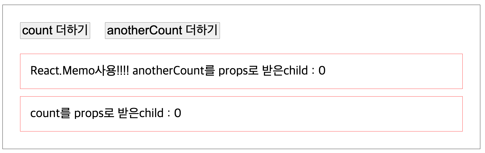
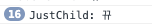
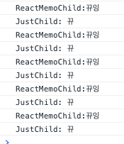
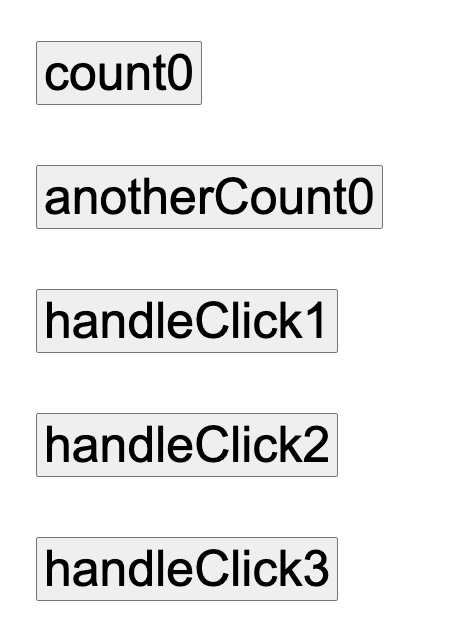
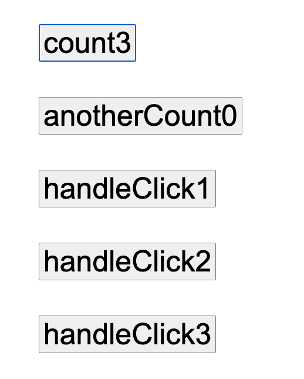
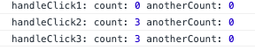
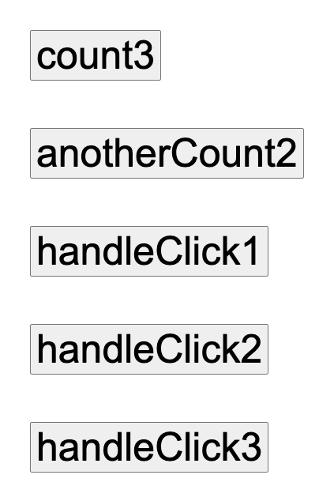
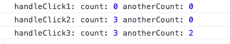

이 시리즈는 사내에서 리액트에 대해 간단한 세미나를 준비한 내용을 정리한 것입니다.

[Intro](https://choichoikule.github.io/blog/post-3)  
[Class](https://choichoikule.github.io/blog/post-4)  
[Hooks](https://choichoikule.github.io/blog/post-5)

이번에는 함수형컴포넌트에 대해서 말해보려고 합니다.  
함수형컴포넌트에서의 핵심은 Hook입니다. Hook은 리액트 v16.8 에 새로 도입된 기능입니다.

먼저 프로그래밍에서 Hooking이란 이미 작성되어있는 코드의 특정지점을 가로채서, 대상코드의 코드를 수정하지 않으면서도 동작방식에 변화를 주는 기술이라고 정의합니다.
리액트 훅도 이와 비슷하게 클래스형 컴포넌트에서 사용하던 기능들을 hook들을 통해서 함수형 컴포넌트로 손쉽게 가져오고 이를 사용할 수 있도록 만든 것으로,
기존에는 함수형 컴포넌트에서 할 수 없었던 상태 관리나, 컴포넌트 생명주기와 비슷한 작업을 수행하도록 하는 것을 가능하게 만들어줍니다.  
다른 모듈들처럼 'react'로 부터 import해와서 사용하면 됩니다.
리액트에서 hook은 use라는 이름으로 시작됩니다.(hooking의 개념에서 출발해 생각한다면 이름도 잘 지은것 같습니다. state를 사용한다. effect를 사용한다). 리액트의 내장 훅은 아래와 같은 것들이 있고 이외에도 사용자가 직접 커스텀 훅을 만들어 사용할 수도 있습니다.

기본 훅 중 useState와 useEffect의 사용방법을 살펴보고나서 hook이 실제로 어떻게 동작하는지 클로저 개념을 기반으로 설명한 후에 마무리하고자 합니다.

- [기본 Hook](https://ko.reactjs.org/docs/hooks-reference.html#basic-hooks)
  - [useState](https://ko.reactjs.org/docs/hooks-reference.html#usestate)
  - [useEffect](https://ko.reactjs.org/docs/hooks-reference.html#useeffect)
  - [useContext](https://ko.reactjs.org/docs/hooks-reference.html#usecontext)
- [추가 Hooks](https://ko.reactjs.org/docs/hooks-reference.html#additional-hooks)
  - [useReducer](https://ko.reactjs.org/docs/hooks-reference.html#usereducer)
  - [useCallback](https://ko.reactjs.org/docs/hooks-reference.html#usecallback)
  - [useMemo](https://ko.reactjs.org/docs/hooks-reference.html#usememo)
  - [useRef](https://ko.reactjs.org/docs/hooks-reference.html#useref)
  - [useImperativeHandle](https://ko.reactjs.org/docs/hooks-reference.html#useimperativehandle)
  - [useLayoutEffect](https://ko.reactjs.org/docs/hooks-reference.html#uselayouteffect)
  - [useDebugValue](https://ko.reactjs.org/docs/hooks-reference.html#usedebugvalue)

### useState

useState는 이름처럼 클래스 컴포넌트에서 사용했었던 state와 setState기능을 사용할 수 있게 해주는 훅입니다. useState를 사용하기 위해서는 `const [state, setState] = useState(state에 할당해줄 초기값)` 구조로 다음과 같이 작성하면 됩니다.

```jsx
import React, { useState } from "react"

function Counter() {
  const [number, setNumber] = useState(0)

  const onIncrease = () => {
    setNumber((prevNumber) => prevNumber + 1)
  }

  const onDecrease = () => {
    setNumber((prevNumber) => prevNumber - 1)
  }

  return (
    <div>
      <h1>{number}</h1>
      <button onClick={onIncrease}>+1</button>
      <button onClick={onDecrease}>-1</button>
    </div>
  )
}

export default Counter
```

위의 코드에서 number라는 state는 초기값 0을 할당받고, 클래스의 setState와 같은 기능을 하는 setNumber로 state값을 이전 클래스 컴포넌트에서 setState가 그랬듯이 number의 상태값을 바꿔줄 수 있습니다.

여기서 주의하셔야 하는 점은, 함수형태를 넣어주어야 하지, 함수를 다음과 같이 실행하시면 안됩니다.
`onClick={onIncrease()}` 이렇게 하면 렌더링되는 시점에서 함수가 호출되어버립니다.

### useEffect

useEffect 함수는 앞서 클래스의 라이프사이클 메서드에서 componenetDidMount, componentDidUpdate, componentWillUnmount 세가지와 비슷한 역할을 할 수 있습니다.완전히 동일하게 작동하는 것은 아니지만, 컴포넌트가 마운트되었을때, 언마운트 되었을때, 업데이트 되었을때의 실행시키고 싶은 작업을 라이프사이클 메서드와 유사하게 처리할 수 있습니다.
기본형태는 `useEffect(function,deps)` 입니다. function 자리에는 useEffect로 실행시키고 싶은 동작을 하는 함수를 넣어주면 됩니다. deps는 의존성배열로 useEffect를 실행시킬 트리거가 되는 값들입니다. useEffect는 이 배열에 담긴 값들을 감시하고 있다가 변화가 생겼을때 첫번째 인자로 받은 함수를 실행시킵니다. 따라서 deps 자리를 어떻게 적어주냐에 따라 다르게 동작합니다.

1. dpes에 특정값을 넣어줬을때

```jsx
useEffect(() => {
  console.log("state바뀔때마다 실행할꼬당~~~")
}, [state])
```

위에서 잠깐 언급한것처럼 이렇게 사용하면 마운트 될때 한 번, 그리고 배열안에 담긴 값이 바뀔때 마다 useEffect안의 함수가 실행됩니다. 라이프사이클 메서드에서 componentDidUpdate와 유사한 역할입니다.
좀 더 구체적인 예시를 볼까요.

```jsx

다른예시)
import React, { useState, useEffect } from "react";

export default function MyComponent() {
  const [count, setCount] = useState(0);
  const [anotherCount, setAnotherCount] = useState(0);
  useEffect(() => {
    console.log("useEffect 실행");
    document.title = `업데이트 횟수 : ${count}`;
  }, [count]);
  return (
    <div>
      <button onClick={() => setCount(count + 1)}>count 더하기</button>
      <button onClick={() => setAnotherCount(anotherCount + 1)}>
        anotherCount 더하기
      </button>
    </div>
  );
}
```

이렇게 작성하면 컴포넌트가 화면에 보여질때 useEffect가 한번 실행되고, 버튼을 눌러서 count가 바뀔때마다 useEffect가 실행될것입니다. anotherCount가 바뀔때는 변하지 않고요
참고로 위와같은 인라인방식의 함수는 성능에 좋지않습니다. 매 랜더링 마다 새로운 함수가 props으로 전달되고, 버튼 컴포넌트는 다시 랜더링이 일어나기 때문입니다.

```jsx
useEffect(() => {
  document.title = `You clicked ${count} times`
}, [count === 5]) // count가 5일 때만 effect를 재실행합니다.
```

이렇게 조건부로 넣어줄수도 있습니다. 객체도 넣어줄수 있습니다. (별로 추천은 되지 않겠지만)

```jsx
import React, { useEffect } from "react"
import Router from "next/router"

useEffect(() => {
  if (me) {
    alert("로그인이 되어 메인 페이지로 이동합니다.")
    Router.push("/") // id가 생기면 signup 페이지에서 메인 페이지로 이동
  }
}, [me && me.id]) // JavaScript에서 객체는 undefined일 수 있으니,
// `me` 값이 확실히 존재하는 지 판단하기 위해 `&& me.id`를 붙여 guard를 해주어야 합니다.
```

2. deps에 빈배열을 넣었을때

```jsx
useEffect(() => {
  console.log("마운트할때만 실행할거얌~~")
}, [])
```

이렇게 의존성배열에 아무런 값도 지정해주지 않을 경우 useEffect는 아무것도 관찰하지않습니다. 해당 컴포넌트가 마운트 될 때 단 한번 실행합니다. componenetDidMount와 비슷한 역할입니다. 그래서 데이터통신같은 것들을 넣어주기에 적당합니다.

```jsx
import React, { useState, useEffect } from "react"
import ReactDOM from "react-dom"
import axios from "axios"

function App() {
  // Store the users in a state variable.
  // We are passing an empty array as the default value.
  let [users, setUsers] = useState([])

  // The useEffect() hook fires any time that the component is rendered.
  // An empty array is passed as the second argument so that the effect only fires once.
  useEffect(() => {
    axios
      .get("https://jsonplaceholder.typicode.com/users")
      .then((response) => setUsers(response.data))
  }, [])

  return (
    <div className="App">
      <h2>The JSON below is loaded from an external API!</h2>
      <code>{JSON.stringify(users)}</code>
    </div>
  )
}

const rootElement = document.getElementById("root")
ReactDOM.render(<App />, rootElement)
```

3. deps에 아무것도 안써줬때

```jsx
useEffect(() => {
  console.log("렌더링 할때마다 실행할꼬당~~~")
})
```

deps에 아무것도 적지않았다는것은 모든 값에대해 의존적이라는 뜻입니다. 마운트할때와, 모든 state들이 update될때 마다 계속 실행시키겠다는 의미가 됩니다. 아까 예시에서 [count]만 없애봅시다 어떤 버튼을 누르던 console.log가 마구 찍히는 걸 확인할 수 있을 겁니다.

```jsx
import React, { useState, useEffect } from "react"

export default function MyComponent() {
  const [count, setCount] = useState(0)
  const [anotherCount, setAnotherCount] = useState(0)
  useEffect(() => {
    console.log("useEffect 실행")
    document.title = `업데이트 횟수 : ${count}`
  })
  return (
    <div>
      <button onClick={() => setCount(count + 1)}>count 더하기</button>
      <button onClick={() => setAnotherCount(anotherCount + 1)}>
        anotherCount 더하기
      </button>
    </div>
  )
}
```

참고로 useEffect 안에서 useState를 사용할때에는 조심해야합니다. 위에서 썼던 예제를 조금 바꿔서 다시 가져와 보겠습니다. 위의 예제에서 useEffect의 두번째 인자에 []빈배열을 전달하고 있었는데 이번에는 아무것도 전달하지 않았습니다. 이 useEffect는 무한루프에 빠져버려 문제를 일으킬것입니다. 무한루프 과정을 한번 살펴볼까요.

1. Dom이 그려진다.
2. useEffect가 실행되면서 setState에 새로운 값을 할당합니다.
3. state가 바뀐다.
4. state가 바뀌었으니 useEffect가 실행된다.
5. useEffect 안에서 setState가 실행되면서 또 새로운 값을 할당한다.
6. state가 바뀐다.
7. state가 바뀌었으니 useEffect가 실행된다.
   .... 무한반복 OMG

useEffect() componenetDidUpdate처럼 행동할때 useEffect는 렌더링이 끝난 뒤 호출됩니다!!!!

앞의 예제를 다시 가져와서 실행해볼까요. 의존성을 없애니 계속 업데이트 되는 것을 볼 수 있을 것입니다.

```jsx
import React, { useState, useEffect } from "react"
import ReactDOM from "react-dom"
import axios from "axios"

function App() {
  // Store the users in a state variable.
  // We are passing an empty array as the default value.
  let [users, setUsers] = useState([])

  // The useEffect() hook fires any time that the component is rendered.
  // An empty array is passed as the second argument so that the effect only fires once.
  useEffect(() => {
    axios
      .get("https://jsonplaceholder.typicode.com/users")
      .then((response) => setUsers(response.data))
  })

  return (
    <div className="App">
      <h2>The JSON below is loaded from an external API!</h2>
      <code>{JSON.stringify(users)}</code>
    </div>
  )
}

const rootElement = document.getElementById("root")
ReactDOM.render(<App />, rootElement)
```

useEffect를 사용하는 또한가지 방법이 있습니다. 바로 useEffect의 첫번째 인자인 function 내부에서 return값을 지정해주는것입니다. 이것은 componenetWillUnMount와 유사하게 작동합니다.

```jsx
useEffect(() => {
  return () => {
    console.log("나는 정리하는 역할이야암")
  }
}, [])
```

useEffect의 return값은 해당 effect가 더이상 실행할 필요가 없을 때 청소하는 용도입니다.여기서 더 이상 실행할 필요가 없는 경우는 다음 두가지 입니다.

1. dependancy(두번째 인자로 넘기는 배열)가 바뀌어서 effect가 달라져야할 때 (이전 effect 청소)
2. 해당 component가 unmount 될 때
   2번에 해당하는 unmount 될 때만 사용하려면 dependancy가 항상 같도록 `[]`를 넘기면 됩니다.

!! 컴포넌트는 다음과 같은 상황에서 리렌더링됩니다. !!

1. 자기가 받는 props가 변했을때

2. 자기 state가 변했을때

3. 부모가 리렌더링될때

4. forceUpdate함수가 실행될때

컴포넌트가 위와 같은 상황에서 렌더링이 되기 렌더링 최적화를 생각해야 효율적인 프로젝트 구성이 가능합니다. 렌더링 최적화를 도와주는 아이들을 조금만 살펴볼까요!

### useMemo

부모가 렌더링은 되는데 특정자식이 받는 props는 변하지 않아서 리렌더링 시키고 싶지 않은 경우가 있지요!
그때 useMemo를 쓸수 있습니다. `useMemo(func,deps)` 이렇게 사용하고 의존성배열로 받는 값이 변할때만 내부에 있는 컴포넌트나 값을 연산합니다.

UseMemoParent.js

```jsx
import React, { useState } from "react"
import UseMemoChild from "./UseMemoChild"
import JustChild from "./JustChild"
import "./usememo.css"

export default function UseMemoParent() {
  const [count, setCount] = useState(0)
  const [anotherCount, setAnotherCount] = useState(0)

  return (
    <div style={{ border: "1px solid black" }}>
      <button onClick={() => setCount(count + 1)}>count 더하기</button>
      <button onClick={() => setAnotherCount(anotherCount + 1)}>
        anotherCount 더하기
      </button>
      <UseMemoChild anotherCount={anotherCount} />
      <JustChild count={count} />
    </div>
  )
}
```

UseMemoChild.js

```jsx
import React, { useMemo } from "react"

export default function UseMemoChild({ anotherCount }) {
  return useMemo(() => {
    console.log("ReactMemoChild:뀨잉")
    return (
      <div style={{ border: "1px solid red" }}>
        React.Memo사용!!!! anotherCount를 props로 받은child : {anotherCount}
      </div>
    )
  }, [anotherCount])
}
```

JustChild.js

```jsx
import React from "react"

export default function JustChild({ count }) {
  console.log("JustChild: 뀨")
  return (
    <div style={{ border: "1px solid red" }}>
      count를 props로 받은child : {count}
    </div>
  )
}
```

useMemo를 사용한 UseMemoChild는 anotherCount를 인자로 받고 JustChild는 count를 인자로 받습니다. count를 변화시키면!!



아래 보는것처럼 JustChild만 실행됩니다.anotherCount는 useMemo로 감싸서 부모가 리렌더링 되어도 자기 props가 변하지 않는다면 변하지 않그든요



근데 anotherCount를 누르면!!!!! 아래처럼 JustChild도 같이 변해버립니다.



사실 이건 React.Memo를 사용하면 좀더 쉽긴합니다. React.Memo는 HOC이고 useMemo는 hook이라는 차이가 있습니다. HOC(Higher Order Component) 고차 컴포넌트는 컴포넌트를 가져와서 새컴포넌트를 반환하는 함수입니다. 클래스에서도 사용가능합니다.

```jsx
import React from "react"

export default React.memo(function UseMemoChild({ anotherCount }) {
  console.log("ReactMemoChild:뀨잉")
  return (
    <div style={{ border: "1px solid red" }}>
      React.Memo사용!!!! anotherCount를 props로 받은child : {anotherCount}
    </div>
  )
}) // react.Memo를 써도 동일함
```

useMemo는 컴포넌트 뿐만이 아니라 연산을 줄일때도 사용할 수 있습니다. ..시간이 없어서 이 예시는 준비 못했지만 검색해서 꼬옥 사용해보시기 바랍니ㅏㄷ.ㅇ

### useCallback

useCallback은 useMemo와 비슷한데 함수를 기억하는데 최적화 되어있습니다
컴포넌트가 리렌더링될대 우리가 사용하기 위해 만든 그안에있는 함수들도 함께 재생성됩니다. useCallback은 그러한 함수의 재생성을 막아줍니다. 사용할때에는 `useCallback(func,deps)` 이렇게 적어주고 useEffect와 유사하게 의존성배열에 담긴값들을 감시하다가 그 값이 변할때만 함수를 재생성 합니다.

아래와 같은 파일이 있다고 해봅시다.
상태는 count, anothercount가 있고 버튼을 누를때마다 각각이 변합니다.

handleclick버튼은 클릭할때마다 count와 anothercount를 콘솔에 쓰는 함수입니다. handleClick1은 useCallback을 사용했지만 의존성배열에 ㅏ아무것도 전달하지 않았고, handleClick2는 의존성배열에 count만 전달합니다. 마지막 handleClick3은 그냥 함수입니다.

```jsx
import React, { useCallback, useState } from "react"

export default function UseCallback() {
  const [count, setCount] = useState(0)
  const [anotherCount, setAnotherCount] = useState(0)
  const handleClick1 = useCallback(
    () =>
      console.log(
        "handleClick1:",
        "count:",
        count,
        "anotherCount:",
        anotherCount
      ),
    []
  )
  const handleClick2 = useCallback(
    () =>
      console.log(
        "handleClick2:",
        "count:",
        count,
        "anotherCount:",
        anotherCount
      ),
    [count]
  )
  const handleClick3 = () =>
    console.log("handleClick3:", "count:", count, "anotherCount:", anotherCount)

  return (
    <>
      <button onClick={() => setCount(count + 1)}>count{count}</button>
      <button onClick={() => setAnotherCount(anotherCount + 1)}>
        anotherCount{anotherCount}
      </button>
      <button onClick={handleClick1}>handleClick1</button>
      <button onClick={handleClick2}>handleClick2</button>
      <button onClick={handleClick3}>handleClick3</button>
    </>
  )
}
```



count를 올리고 handleClick을 차례대로 눌러봅니다. 의존성배열에 아무것도 전달하지 않은 함수는 계속해서 재생성되지않았기때문에 자기가 처음 생성될때의 count값을 기억하고 있습니다.




이제 anotherCount를 눌러봅시다.handleClick1은 역시나 자기가 처음 생성될때의 값만을 기억합니다.
handleClick2는 의존성배열에 count가 있었기때문에 count가 변할때만 재생성됩니다. anothercount를 변화시킬때는 재생성되지않았습니다. 그래서 anotherCount의 값을 자기가 마지막으로 재생성될때의 값으로 기억하고 있네용




## 함수형업데이트와 useCallback을 적절히 재사용한다면...?

## so Goooood!!!

위 코드의 예제를 조금만 다시한번 가져와 봅니다. 보면 onClick함수에 ()⇒setCount(count+1)의 형태로 상태를 업데이트 해주고 있지요? 이렇게 onClick으로 받는 함수도 리렌ㄷ더링 될때 마다 새로 생성되고 있을 것입니다. 바뀐 카운트 값을 기반으로 1을 더해줘야 하기때문에 그렇게 동작하는게 맞습니다. 여기서 만약에 useCallback을 그냥 적용한다면 ?! count가 초기 생성된 값만 기억하고 있을거기 때문에 계속 1이 출력이 되겠죠! 그런데 이 로직을 count+1이 아니라 어제잠시 소개했었던것 처럼 prevCount ⇒ prevCount+1로 바꿔주고 (setState함수들은 자기 이전 스테이트를 인자로 받고 있습니다....) 이걸 useCallback으로 묶어준다면!!!!! 기능은 제대로 작동하는데 렌더링도 최소화할 수 있겠죠 직접 써보시기 바랍니당

```jsx
  return (
    <>
      <button onClick={() => setCount(count + 1)}>count{count}</button>
      <button onClick={() => setAnotherCount(anotherCount + 1)}>
        anotherCount{anotherCount}
      </button>
      <button onClick={handleClick1}>handleClick1</button>
      <button onClick={handleClick2}>handleClick2</button>
      <button onClick={handleClick3}>handleClick3</button>
    </>
  );
}
```

### useReducer

useState외에도 또다른 새로운 상태관리를 할 수 있는 reducer라는 함수가 있습니다. 사용법도 매우 쉽습니다.
이건 리액트 공홈의 예제를 그대로 가져와봅니다. 먼저 reducer함수를 정의합니다. reducer함수는 동작을 정의하는 함수로 상태와 action을 인자로 받습니다. action을 정의할때는 보통 switch case문을 많이 사용합니다.
state와 다를바 없어보이지만 컴포넌트에서 관리하는 state가 많아질수록 유용합니다.

```jsx
import React, { useReducer } from "react"

function reducer(state, action) {
  switch (action.type) {
    case "INCREMENT":
      return state + 1
    case "DECREMENT":
      return state - 1
    default:
      return state
  }
}

export default function UseReducerTest() {
  const [number, dispatch] = useReducer(reducer, 0)

  const onIncrease = () => {
    dispatch({ type: "INCREMENT" })
  }

  const onDecrease = () => {
    dispatch({ type: "DECREMENT" })
  }

  return (
    <div>
      <h1>{number}</h1>
      <button onClick={onIncrease}>+1</button>
      <button onClick={onDecrease}>-1</button>
    </div>
  )
}
```

자 말이 나온김에 제 거지같은 코드를 한번 같이 리팩토링 해볼까요 state가 겁나 많습니다. popuphandler좀 보세요 오마이갓.......고쳐도 거지같은 것 같긴하지만요. 어쨌든 상태가 많을때 좀 좋습니다.

```jsx
import { IoMdSettings } from "@react-icons/all-files/io/ioMdSettings"
import styled from "styled-components"
import { Props } from "./interface"
import { Meteor } from "meteor/meteor"

function Settings({ reloadHandler, reloadCancelHandler }) {
  const [password, setPassword] = useState("")
  const [guide, setGuide] = useState("default")
  const [popup, setPopup] = useState(false)
  const [showButton, setShowButton] = useState(false)
  const [checker, setChecker] = useState(false)

  const popupHandler = () => {
    setPopup(!popup)
    setShowButton(false)
    setGuide("default")
    setPassword("")
    setChecker(false)
  }

  const inputHandler = (e: KeyboardEvent<HTMLInputElement>) => {
    e.key === "Enter"
      ? passwordChecker()
      : e.key === "Escape"
      ? popupHandler()
      : setPassword(e.target.value)
  }

  const passwordChecker = async () => {
    let comparison = new Promise((res, rej) => {
      Meteor.call("envVariable", password, (error, result) => {
        res(result)
      })
    })
    let waiting = await comparison
    if (waiting) {
      setPassword("")
      setShowButton(true)
      setGuide("default")
      setChecker(false)
    } else {
      setPassword("")
      setGuide("wrong")
    }
  }

  window.addEventListener("keyup", function (e) {
    popup && e.key === "Escape" ? popupHandler() : null
  })

  return (
    <SettingContainer>
      <SettingContents
        isActive={popup}
        onKeyUp={(e) => {
          e.key == "Escape" ? popupHandler() : null
        }}
      >
        <Pass isActive={showButton}>
          <P isActive={guide === "default"}>
            {guide === "default" ? "PASSWORD" : "WRONG PASSWORD"}
          </P>
          <input
            type={"password"}
            maxLength={4}
            value={password}
            onChange={(e) => {
              setPassword(e.target.value)
            }}
            onKeyUp={(e) => inputHandler(e)}
          />
          <button
            onClick={() => {
              passwordChecker()
            }}
          >
            OK
          </button>
        </Pass>
        <ReloadDiv isActive={showButton}>
          <ReloadButton
            onClick={() => {
              reloadHandler()
            }}
          >
            재업로드
          </ReloadButton>
          <ReloadButton
            onClick={() => {
              reloadCancelHandler()
            }}
          >
            재업로드 취소
          </ReloadButton>
        </ReloadDiv>
      </SettingContents>
      <IconBox>
        <IoMdSettings
          fill={"#919191"}
          size={"1.5em"}
          onClick={() => popupHandler()}
        />
      </IconBox>
    </SettingContainer>
  )
}
export default Settings
```

```jsx
import React, { useReducer, useState } from "react"
import { IoMdSettings } from "@react-icons/all-files/io/ioMdSettings"
import styled from "styled-components"
import { Props } from "./interface"
import { Meteor } from "meteor/meteor"

const initialSettingState = {
  password: "",
  guide: "default",
  popup: false,
  showButton: false,
  checker: false,
}

const reducer = (state, action) => {
  switch (action.type) {
    case "CLOSEPOPUP":
      return {
        popup: false,
        showButton: false,
        guide: "default",
        password: "",
        checker: false,
      }
    case "OPENPOPUP":
      return { ...state, popup: true }
    case "WRONGPASSWORD":
      return { ...state, password: "", guide: "wrong" }
    case "INPUT":
      return { ...state, password: action.password }
    case "CORRECTPASSWORD":
      return {
        ...state,
        password: "",
        showButton: true,
        guide: "default",
        checker: false,
      }
    default:
      return state
  }
}

function Settings({ reloadHandler, reloadCancelHandler }) {
  const [settingState, dispatch] = useReducer(reducer, initialSettingState)
  const { popup, showButton, password, guide } = settingState
  const onOpen = () => {
    dispatch({ type: "OPENPOPUP" })
  }
  const onClose = () => {
    dispatch({ type: "CLOSEPOPUP" })
  }
  const onInput = (password) => {
    dispatch({ type: "INPUT", password: password })
  }
  const onEnter = (e) => {
    e.key === "Enter"
      ? onCheck()
      : e.key === "Escape"
      ? onClose()
      : onInput(e.target.value)
  }
  const onCheck = async () => {
    let comparison = new Promise((res, rej) => {
      Meteor.call("envVariable", password, (error, result) => {
        res(result)
      })
    })
    let waiting = await comparison
    if (waiting) {
      dispatch({ type: "CORRECTPASSWORD" })
    } else {
      dispatch({ type: "WORNGPASSWORD" })
    }
  }
  window.addEventListener("keyup", function (e) {
    popup && e.key === "Escape" ? onClose() : null
  })
  return (
    <SettingContainer>
      <SettingContents
        isActive={popup}
        onKeyUp={(e) => {
          e.key == "Escape" ? onClose() : null
        }}
      >
        <Pass isActive={showButton}>
          <P isActive={guide === "default"}>
            {guide === "default" ? "PASSWORD" : "WRONG PASSWORD"}
          </P>
          <input
            type={"password"}
            maxLength={4}
            value={password}
            onChange={(e) => {
              onInput(e.target.value)
            }}
            onKeyUp={onEnter}
          />
          <button onClick={onCheck}>OK</button>
        </Pass>
        <ReloadDiv isActive={showButton}>
          <ReloadButton
            onClick={() => {
              reloadHandler()
            }}
          >
            재업로드
          </ReloadButton>
          <ReloadButton
            onClick={() => {
              reloadCancelHandler()
            }}
          >
            재업로드 취소
          </ReloadButton>
        </ReloadDiv>
      </SettingContents>
      <IconBox>
        <IoMdSettings fill={"#919191"} size={"1.5em"} onClick={onOpen} />
      </IconBox>
    </SettingContainer>
  )
}
export default Settings
```

여기까지 몇가지 훅을 살펴보았습니당~~

그리고 알아둬야 할 것은 **최상위에서만 Hook들을 호출해야하기 때문에** 반복문 조건문등의 중첩된 함수내에서 사용할 수 없으며, **오직 리액트 함수내에서만 hook을 호출해야 한다는 것입니다. hook은** 일반적인 자바스크립트 함수에서 호출할 수 없습니다. 대신에 커스텀 훅을 만들어서 그 내부에서 훅을 호출할 수는 있습니다.

왜 이런 규칙이 있을 수 밖에 없는지 useState를 직접 만들어 보면서 같이 이해해봅시다. 먼저 useState를 만들어 보겠습니다.

```jsx
function useState(initialValue) {
  var _val = initialValue
  function state() {
    return _val
  }
  function setState(newVal) {
    _val = newVal // _val를 노출하지 않고 _val를 변경합니다.
  }
  return [state, setState] // 외부에서 사용하기 위해 함수들을 노출
}

==============================================================================

var [foo, setFoo] = useState(0) // 배열 구조분해 사용
console.log(foo()) // 0 출력 - 위에서 넘긴 initialValue
setFoo(1) // useState의 스코프 내부에 있는 _val를 변경합니다.
console.log(foo()) // 1 출력 - 동일한 호출하지만 새로운 initialValue
```

자 비슷하게 구현은 되었지만 뭔가 이상합니다. 우리의 state는 변수였잖아요. 함수식이 아니라 그냥 변수로 선언한다면 어떻게 될까요?

```jsx
function useState(initVal) {
  let _val = initValue
  const state = _val
  const setState = (newVal) => {
    _val = newVal
  }
  return [state, setState]
}
const [count, setCount] = useState(1)
console.log(count) // 1
setCount(2)
console.log(count) // 1 (????????????)
```

변한 값을 새로 넣어줬으니 변한 값을 가져와야 할 것 같은데 그렇지 않습니다. count의 값 변화가 우리가 리액트를 쓸 때처럼 즉각적으로 바뀌지 않습니다. count 는 한번 가져오고 끝난 값이기 때문입니다. 이게 바로 클로저 입니다. 클로저란 함수가 함수가 속한 렉시컬 스코프를 기억하여 함수가 렉시컬 스코프 밖에서 실행될 때에도 이 스코프에 접근할 수 있게 하는 기능을 뜻합니다. count는 useState(1)을 통해서 가져올때의 렉시컬 스코프만을 기억하고 1만 출력하게 됩니다. 하지만 위에서 처럼 함수형으로 호출한다면 호출할때마다 값을 가져오기 때문에 변화가 반영된 값을 가져올 수 있게 되는 것이죠.

그래도 우리는 여전히 리액트처럼 state를 사용하고 싶습니다. 그럼 함수에 한번 더 넣어버리면 됩니다. 리액트의 useState와 더 비슷하게 만들기 위해 미니 리액트도 만들어보겠습니다.

```jsx
const React = (() => {
  let value

  const useState = (initialValue) => {
    const state = value || initialValue
    // !!!React의 매 실행마다 새로 할당됩니다.!!!
    // useState가 선언될 당시 value가 맨 상위에 있었죠 이것도 클로저입니다.
    const setState = (newState) => {
      value = newState
    }
    return [state, setState]
  }

  const render = (ReactComponent) => {
    const renderedComponent = ReactComponent()
    renderedComponent.render()
    return renderedComponent
  }

  return { useState, render }
})()
```

직접 만든 리액트에는 value, useState, render가 선언되어있습니다. useState와 render는 React가 호출될때마다 그 당시의 리액트 내부의 환경을 기억할 것입니다. 이로써 그냥 변수로 사용할 수 있게 되었습니다. 이중 클로저입니다.

이번에는 컴포넌트에서 직접 사용해보겠습니다.

```jsx
const React = (() => {
  let value;
  const useState = (initialValue) => {
    const state = value || initialValue;
    const setState = (newState) => {
      value = newState;
    };

    return [state, setState]; //리턴
  };

  const render = (ReactComponent) => {
    const renderedComponent = ReactComponent();
    renderedComponent.render();
    return renderedComponent; //리턴
  };

  return { useState, render }; //또 리턴
})();

function Counter() {
  const [count, setCount] = React.useState(0)
  return {
    click: () => setCount(count + 1),
    render: () => console.log('render:', { count }),
  }
}
============================================================================
let App
App = React.render(Counter)
// render: { count: 0 }
App.click()
App = React.render(Counter)
// render: { count: 1 }
```

우리가 작성한 미니리액트 같이 즉시실행함수로 작성하면 함수가 실행된 결과만을 저장합니다.

위의 코드를 풀어서 설명하면 다음과 같습니다.

1. 리액트 즉시실행 ⇒ useState와 render함수가 결과로 반환됨 (useState와 render함수가 선언된것임)
2. useState함수 state와 setState를 결과값으로 반환합니다.
3. useStae내부에서는 state에 밸류가 있으면 밸류를 없으면 이니셜밸류를 할당하고
4. 새 값을 인자로 받아 밸류를 바꾸어 버리는 setState를 정의합니다.
5. 렌더함수는 컴포넌트 함수를 받아서 실행한 결과인 렌더된컴포넌트를 반환하고, 그전에 렌더된컴포넌트에서 렌더메소드를 한번 호출합니다.
6. 카운터함수를 선언합니다.
7. 카운터함수는 useState를 사용하고 초기값으로 0을 할당하며 클릭과 렌더라는 메소드를 내보내는 함수입니다.
8. App을 선언합니다.
9. 앱은 리액트의 렌더함수에 카운터함수를 넣은 결과입니다.
   카운터함수 실행 ⇒ useState에 value 0으로 할당⇒ value가 있으니 state는 valuedls 0 ⇒ 이 결과가 렌더드컴포넌트라는 변수에 저장됨 ⇒ 이변수에서 렌더메소드 호출⇒ state인 count 호출하라고함 ⇒ 아까 바꾸어줬으니 0이 콘솔로그에 찍힘 ⇒ 그리고나서 이 렌더드 컴포넌트 반환 ⇒ 이걸 담은 변수인 App을 통해 클릭 메소드 실행 ⇒ setState에 카운트새로 넣어줌 ⇒ value 바뀜 ⇒ 다시렌더호출 ⇒ 아까 바뀐 value 아웃풋
10. 이 모든 것의 기반은 함수는 자기가 선언된 환경을 기억하고 있다는 자바스크립트의 클로저입니다.

하지만 실제 훅을 사용하게 된다면 한 컴포넌트 안에서 여러 상태를 관리하기 위해 여러 훅을 만들어 쓰는 경우가 많습니다. 그런데 value 하나에 의존하는 지금 상태에서 컴포넌트 안에 useState 를 두번 호출하게 된다면?

```jsx
function Component() {
  const [count, setCount] = React.useState(1)
  const [text, setText] = React.useState("apple")
  return {
    render: () => console.log({ count, text }),
    click: () => setCount(count + 1),
    type: (word) => setText(word),
  }
}
var App = React.render(Component) // {count: 1, text: 'apple'}
App.click()
var App = React.render(Component) // {count: 2, text: 2}
App.type("banana")
var App = React.render(Component) // {count: 'banana', text: 'banana'}
```

보다시피 중간에 값이 덮어씌워지게 됩니다. 이 값을 좀 더 손쉽게 관리하려면 각 값 별로 배열에 담아 다루면 쌉가능!

```jsx
const React = (function () {
  let hooks = []
  let idx = 0
  function useState(initVal) {
    const state = hooks[idx] || initVal
    const _idx = idx // 이 훅이 사용해야 하는 인덱스를 가둬둔다.
    const setState = (newVal) => {
      hooks[_idx] = newVal
    }
    idx++ // 다음 훅은 다른 인덱스를 사용하도록 한다.
    return [state, setState]
  }
  function render(Component) {
    idx = 0 // 랜더링 시 훅의 인덱스를 초기화한다.
    const C = Component()
    C.render()
    return C
  }
  return { useState, render }
})()
```

이렇게 배열에 담아서 값을 다루기 때문에 Hook은 호출하는 순서가 매우 중요하고, 조건부로 훅이 호출되거나 루프 안에서 훅이 호출되어야 하는 경우 등이 있다면 인덱스의 순서를 보장할 수 없고, 상태의 관리도 보장할 수 없게 됩니다. 여기로부터 앞서말했던 훅의 규칙이 생겨난것입니다. 더해서 우리가 배열비구조화 할당 방식으로 훅들을 가져오는 이유와 리액트가 컴포넌트를 그릴때마다 state는 그 한번의 렌더링에서만 유효한 값이라는 점도 함께 와닿았을거라 생각합니다. useEffect도 만들어보고 싶으신 분은 [이글](https://hewonjeong.github.io/deep-dive-how-do-react-hooks-really-work-ko/)을 참고해주세요.

참고:  
[https://xiubindev.tistory.com/100](https://xiubindev.tistory.com/100)  
[https://react.vlpt.us/basic/07-useState.html](https://react.vlpt.us/basic/07-useState.html)  
[https://velog.io/@kwonh/ReactHook-useState-와-useEffect-로-상탯값과-생명주기-사용하기](https://velog.io/@kwonh/ReactHook-useState-%EC%99%80-useEffect-%EB%A1%9C-%EC%83%81%ED%83%AF%EA%B0%92%EA%B3%BC-%EC%83%9D%EB%AA%85%EC%A3%BC%EA%B8%B0-%EC%82%AC%EC%9A%A9%ED%95%98%EA%B8%B0)  
[https://velog.io/@bigbrothershin/React-useEffect의-의존성에-관하여](https://velog.io/@bigbrothershin/React-useEffect%EC%9D%98-%EC%9D%98%EC%A1%B4%EC%84%B1%EC%97%90-%EA%B4%80%ED%95%98%EC%97%AC)  
[https://codesandbox.io/s/l283njoyo7?file=/src/index.js:0-834](https://codesandbox.io/s/l283njoyo7?file=/src/index.js:0-834)  
[https://jsdev.kr/t/react-useeffect-return/5676](https://jsdev.kr/t/react-useeffect-return/5676)  
[https://ryusae.tistory.com/9](https://ryusae.tistory.com/9)  
[https://hewonjeong.github.io/deep-dive-how-do-react-hooks-really-work-ko/](https://hewonjeong.github.io/deep-dive-how-do-react-hooks-really-work-ko/)
